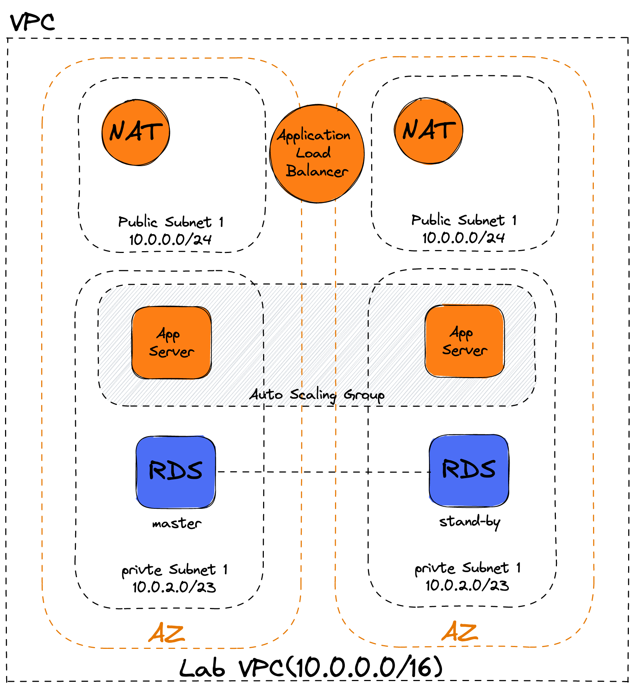

# Distributed Session On HA Environment With AWS

to know how to distribute session in HA environment.

## AWS에서 고가용성 구성에서 세션을 유지시키는 방법

1. 로드밸런서의 sticky session 옵션 사용
2. dynamodb에 세션 저장
3. elastic cache for redis에 세션 저장

## Spring-Boot에서 Session 사용하기

### 도커 이미지

- tag: znxkznxk1030/spring-simple-session
- [DockerHub](https://hub.docker.com/repository/docker/znxkznxk1030/spring-simple-session)

### 세션으로 이용할 UserInfo

```java
@Component
@Scope(value = WebApplicationContext.SCOPE_SESSION, proxyMode = ScopedProxyMode.TARGET_CLASS)
@Getter
@Setter
@ToString
public class UserInfo implements Serializable {
  private static final long serialVersionUID = 1L;

  private String userId;
  private String userNm;
}
```

- \@Scope: Bean을 Session Scope에서 생명주기를 갖도록 하고, CGLIB를 이용해서 인테페이스 없이 클래스만으로도 빈을 동적 생산하도록 한다.
- [스프링 부트 - 동적 프록시 기술(CGLIB, ProxyFactory)](https://velog.io/@gmtmoney2357/%EC%8A%A4%ED%94%84%EB%A7%81-%EB%B6%80%ED%8A%B8-%EB%8F%99%EC%A0%81-%ED%94%84%EB%A1%9D%EC%8B%9C-%EA%B8%B0%EC%88%A0CGLIB-ProxyFactory)

### 테스트를 위한 간단한 컨트롤러

```java
@RestController
public class SessionController {

  @Resource
  private UserInfo userInfo;

  @PostMapping(value = "login", consumes = "application/json", produces = "application/json")
  public String login(@RequestBody UserDoc body) {

    userInfo.setUserId(body.getUserId());
    userInfo.setUserNm(body.getUserNm());
    return userInfo.toString();
  }

  @GetMapping(value = "session", produces = "application/json")
  public String get() {
    return userInfo.toString();
  }

}
```

### Postman을 이용한 테스트

#### 1. 세션을 저장하도록 POST 요청


#### 2. 해당 세션에 UserInfo가 저장되어있는지 확인


#### 3. JSESSIONID를 강제로 변환시키기 ( 세션 바꾸기 )


#### 4. 다른 세션에서는 UserInfo가 저장되지 않은 것 확인하기


## AWS에서 고가용성 환경 만들기

[실습 4 – 고가용성 환경 생성](https://github.com/znxkznxk1030/aws-t2/tree/main/ArchitectOnAWS/training4)



- 로드밸런서가 두개의 가용영역에 걸쳐 있는 App Server에 트래픽을 분산시켜 보내주게 된다.

```bash
# Docker Install
sudo yum update

sudo yum install apt-transport-https
sudo yum install ca-certificates
sudo yum install curl
sudo yum install software-properties-common

sudo yum search docker
sudo yum info docker
sudo yum --disablerepo=docker-ce-stable install docker
sudo systemctl enable docker.service
yes
sudo systemctl start docker.service

# Docker Pull
sudo docker pull znxkznxk1030/spring-simple-session:0.0.1

# Docker Run
sudo docker run -d -p 80:8080 znxkznxk1030/spring-simple-session:0.0.1
```

### 고가용성 환경에서 세션 유지 문제점


- 1번째 요청에서 App Server 1과의 세션이 체결되었다.
- 로드밸런서의 트래픽이 두번째 요청을 App Server 2로 보내게 된다면, 1번째 요청에서 체결한 세션을 찾을 수 없는 문제점이 생기게 된다.

## Reference

- [Spring Boot Session 사용하기 (Bean Scope)](https://gofnrk.tistory.com/42)
- [스프링 부트 - 동적 프록시 기술(CGLIB, ProxyFactory)](https://velog.io/@gmtmoney2357/%EC%8A%A4%ED%94%84%EB%A7%81-%EB%B6%80%ED%8A%B8-%EB%8F%99%EC%A0%81-%ED%94%84%EB%A1%9D%EC%8B%9C-%EA%B8%B0%EC%88%A0CGLIB-ProxyFactory)

ssh -i hjys.pem ec2-user@ec2-13-209-91-0.ap-northeast-2.compute.amazonaws.com