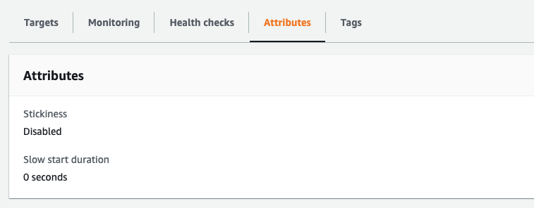

# How to Persist Sessions in a High Availability Environment on AWS

3 Ways Of Persisting Sessions On AWS HA Environment

- [How to Persist Sessions in a High Availability Environment on AWS](#how-to-persist-sessions-in-a-high-availability-environment-on-aws)
  - [AWS에서 고가용성 구성에서 세션을 유지하는법](#aws에서-고가용성-구성에서-세션을-유지하는법)
    - [고가용성 환경에서 세션 유지 문제점](#고가용성-환경에서-세션-유지-문제점)
    - [유지되지 않는 세션 테스트](#유지되지-않는-세션-테스트)
  - [1. Sticky Session](#1-sticky-session)
    - [Stickiness 사용 ( EC2 > 로드 밸런싱 > 대상그룹 )](#stickiness-사용--ec2--로드-밸런싱--대상그룹-)
    - [Sticky Session | 결과](#sticky-session--결과)
    - [Sticky Session | 장점](#sticky-session--장점)
      - [가장 쉬운 적용방법](#가장-쉬운-적용방법)
      - [높은 적용성](#높은-적용성)
    - [Sticky Session | 단점](#sticky-session--단점)
      - [로드밸런서의 성능 저하](#로드밸런서의-성능-저하)
      - [재해발생 시 복구 불가능](#재해발생-시-복구-불가능)
  - [2. DocumentDB](#2-documentdb)
    - [DocumentDB 생성](#documentdb-생성)
    - [pom.xml에 Spring Session 의존성 주입](#pomxml에-spring-session-의존성-주입)
    - [Spring Boot에 DocumentDB 연동](#spring-boot에-documentdb-연동)
    - [DocumentDB | 장점](#documentdb--장점)
      - [영속성](#영속성)
      - [NoSql의 장점](#nosql의-장점)
    - [DocumentDB | 단점](#documentdb--단점)
      - [I/O 성능](#io-성능)
      - [MongoDB와 호환성](#mongodb와-호환성)
  - [3. ElastiCache For Redis](#3-elasticache-for-redis)
    - [AWS | Elasticache for redis 생성하기](#aws--elasticache-for-redis-생성하기)
      - [ElastiCache > Redis > 생성](#elasticache--redis--생성)
      - [VPC와 서브넷 설정](#vpc와-서브넷-설정)
      - [정상 생성 확인하기](#정상-생성-확인하기)
    - [Spring Session에서 Redis 설정하기](#spring-session에서-redis-설정하기)
      - [pom.xml](#pomxml)
      - [application.yaml](#applicationyaml)
      - [RedisSessionConfig.java](#redissessionconfigjava)
        - [Spring Session using Lettuce connecting to AWS ElastiCache Redis](#spring-session-using-lettuce-connecting-to-aws-elasticache-redis)
    - [ElastiCache For Redis | 장점](#elasticache-for-redis--장점)
      - [NoSql Database로서의 장점](#nosql-database로서의-장점)
      - [In-Memory 기반의 높은 I/O 성능](#in-memory-기반의-높은-io-성능)
      - [비용](#비용)
        - [요금 비교 ( 서울 리전 | 온디멘드 | t3.medium )](#요금-비교--서울-리전--온디멘드--t3medium-)
    - [정상적으로 세션이 유지되는 것 확인하기.](#정상적으로-세션이-유지되는-것-확인하기)
    - [ElastiCache For Redis | 단점](#elasticache-for-redis--단점)
      - [장애시 복구 불가능](#장애시-복구-불가능)
      - [Redis와의 호환성](#redis와의-호환성)
      - [비영속성](#비영속성)
  - [부록](#부록)
    - [DockerHub 이미지 빌드](#dockerhub-이미지-빌드)
      - [1. Dockerfile 만들기](#1-dockerfile-만들기)
      - [2. \.jar 파일로 만들기](#2-jar-파일로-만들기)
      - [3. docker image 빌드](#3-docker-image-빌드)
      - [4. docker image push](#4-docker-image-push)
    - [Postman을 이용한 세션 테스트](#postman을-이용한-세션-테스트)
    - [테스트용 도커 이미지](#테스트용-도커-이미지)
    - [세션으로 이용할 UserInfo](#세션으로-이용할-userinfo)
    - [테스트를 위한 간단한 컨트롤러](#테스트를-위한-간단한-컨트롤러)
    - [AWS에서 고가용성 환경 만들기](#aws에서-고가용성-환경-만들기)
    - [시작 탬플릿](#시작-탬플릿)
    - [Redis와 Cookie](#redis와-cookie)
    - [Redis Install & Start ( Mac OS)](#redis-install--start--mac-os)
    - [Redis Config Password](#redis-config-password)
  - [Reference](#reference)

## AWS에서 고가용성 구성에서 세션을 유지하는법

1. sticky session 옵션을 사용하여 체결된 App Server와만 연결을 유도한다.
2. DocumentDB에 세션정보를 저장하여 세션을 영구적으로 남긴다.
3. ElastiCache for redis를 이용하여 세션 정보를 캐싱하여 사용한다.

### 고가용성 환경에서 세션 유지 문제점


- 1번째 요청에서 App Server 1과의 세션이 체결되었다.
- 로드밸런서의 트래픽이 두번째 요청을 App Server 2로 보내게 된다면, 1번째 요청에서 체결한 세션을 찾을 수 없는 문제점이 생기게 된다.

### 유지되지 않는 세션 테스트

- [고가용성 환경](#aws에서-고가용성-환경-만들기) 으로 App Server1, 2를 구성하였습니다.


1. 5A로 시작하는 세션키로 유저 정보 저장.
2. 5A를 세션키로 세젼정보 ( 유저 정보 ) 불러오기.

- 같은 세션키로 접근하여도 한번은 null을 가져오고, 한번은 정상적으로 불러온다.
- 이는 로드밸런서 ( ALB )가 한번은 세션이 채결된 App Server 1로 보내주고, 한번은 세션이 채결되지 않은 App Server 2로 보내주기 때문이다.

## 1. Sticky Session

- **전체 소스는 spring-simple-session 폴더에 있습니다.**

- 로드밸런서의 Sticky Session 옵션을 설정하는 방법은
- 로드밸런서가 관리하는 대상그룹에서 설정할 수 있다.

<!-- ### EC2 > 로드 밸런싱 > 대상그룹 -->

<!--  -->

<!-- ### 대상그룹의 속성확인 -->

<!-- 
 -->

### Stickiness 사용 ( EC2 > 로드 밸런싱 > 대상그룹 )


### Sticky Session | 결과


- 세션 정보를 업데이트 하고
- GET 으로 세션정보를 가져올 때 항상 세션정보를 잘 가져옴을 알 수 있다.

### Sticky Session | 장점

#### 가장 쉬운 적용방법

- 콘솔에서 적용하는 것 이외의 별다른 조치를 취하지 않더라도 즉시 적용가능하다.

#### 높은 적용성

- 해당 인스턴스가 인스턴스 내부 메모리 ( 인스턴스 스토어 ) 를 이용해서 프로세스를 처리하는 중에 있는 등의 비이상적인 여러 상황속에서도 적용가능하다.

### Sticky Session | 단점

#### 로드밸런서의 성능 저하

- 초기 당면한 세션 비고정되는 문제는 해결하였지만, App Server 1과 2에 균등하게 트래픽을 분산 시켜줘야하는 로드밸런서는 세션 고정으로 인해 트래픽 불균형이 일어 날 수 있다.
- 예를 들어, App Server 1과 세션이 체결된 사용자들이 오래 서비스를 사용하고 있다면 App Server 2는 그만큼 트래픽을 받지 못하는 상황이 오게된다.

#### 재해발생 시 복구 불가능

- 세션은 Default 구성으로 인스턴스내의 파일에 세션이 저장된다.
- 즉, App Server 1의 서비스가 중단 될 경우, App Server 1과 체결된 세션은 모두 강제로 종료되는 상황이 벌어지게 된다.

## 2. DocumentDB


- [Spring Session MongoDB](https://spring.io/projects/spring-session-data-mongodb) ( AWS의 DocumentDB는 MongoDB와 호환된다. )를 이용하여 NoSql DB를 세션저장소로 이용할 수 있다.

### DocumentDB 생성


- DocumentDB의 파티션키는 검색속도와 연관 됨으로, 고유한 값으로 지정한다.

### pom.xml에 Spring Session 의존성 주입

```xml
<dependency>
  <groupId>org.springframework.session</groupId>
  <artifactId>spring-session-core</artifactId>
</dependency>
<dependency>
  <groupId>org.springframework.session</groupId>
  <artifactId>spring-session-data-mongodb</artifactId>
</dependency>
```

### Spring Boot에 DocumentDB 연동

- application.properties

```properties
spring.data.mongodb.host={{ Your DocumentDB DNS URL }}
spring.data.mongodb.port=27017
spring.data.mongodb.database=prod
```

- HttpSessionConfig.java

```java
@EnableMongoHttpSession
public class HttpSessionConfig {
    @Bean
    public JdkMongoSessionConverter jdkMongoSessionConverter() {
        return new JdkMongoSessionConverter(Duration.ofMinutes(30));
    }
}
```

### DocumentDB | 장점

#### 영속성

- 한번 저장한 세션은 DB에 영원히 저장되어 향후 세션을 이용한 분석 등을 하기에 적합하다.

#### NoSql의 장점

- Spring Session에서는 관계형 데이터 베이스도 지원하지만,
- 그에 비해 DocumentDB를 이용하게 되면 스키마를 자유롭게 확장 시킬수 있고, 용량은 수평 확장이 가능하다

### DocumentDB | 단점

#### I/O 성능

- 메모리가 아닌 디스크를 이용하기 때문에 세션을 읽고 쓰는데 드는 시간이 높다.

#### MongoDB와 호환성

- 기본적으로 DocumentDB는 MongoDB를 호환하지만, 최신 버전을 지원하지 않는다.
- 3.6 및 4.0 API 과 호환 ( 현재 MongoDB의 최신 버전은 5버전 이상이다. )
- 추가적으로 DocumentDB보다 더 높은 성능의 DynamoDB도 지원하지만, DynamoDB는 Spring Session 과의 호환이 되지 않는다.

## 3. ElastiCache For Redis


### AWS | Elasticache for redis 생성하기

#### ElastiCache > Redis > 생성


#### VPC와 서브넷 설정


- App Server 1,2가있는 VPC내에서 프라이빗 서브넷 2개 ( 2곳의 다른 가용영역 )에 배치하여 클러스터 구성

#### 정상 생성 확인하기


- 기본엔드포인트가 Spring Boot에서 사용할 Redis의 엔드포인트가 된다.

### Spring Session에서 Redis 설정하기

- **전체 소스는 spring-redis 폴더에 있습니다.**

#### pom.xml

- spring-boot-starter-data-redis, spring-session-data-redis 의존성 추가

```xml
<dependency>
    <groupId>org.springframework.boot</groupId>
    <artifactId>spring-boot-starter-data-redis</artifactId>
</dependency>
<dependency>
    <groupId>org.springframework.session</groupId>
    <artifactId>spring-session-data-redis</artifactId>
</dependency>
```

#### application.yaml

```yml
spring:
  redis:
    host: << Your Redis Server >>
    port: 6379
    #    password: mypass
    pool:
      max-idle: 8
      min-idle: 0
      max-active: 8
      max-wait: -1
```

#### RedisSessionConfig.java

- host,port의 기본 값은 각각 localhost, 6373 이다.
- Elasticache 에서 Redis를 올릴때 ConfigureRedisAction에서 문제가 있어서 옵션 없음으로 선택한다 ( NO_OP )

##### [Spring Session using Lettuce connecting to AWS ElastiCache Redis](https://stackoverflow.com/questions/62761730/spring-session-using-lettuce-connecting-to-aws-elasticache-redis)


```java
@EnableRedisHttpSession
public class RedisSessionConfig {

    @Value("${spring.redis.host}")
    private String redisHost;

    @Value("${spring.redis.port}")
    private int redisPort;

    @Bean
    public LettuceConnectionFactory connectionFactory() {
        return new LettuceConnectionFactory(redisHost, redisPort);
    }

    @Bean
    public ConfigureRedisAction configureRedisAction() {
        return ConfigureRedisAction.NO_OP;
    }

    @Bean
    public RedisTemplate<String, Object> redisTemplate() {
        RedisTemplate<String, Object> redisTemplate = new RedisTemplate<>();
        redisTemplate.setConnectionFactory(connectionFactory());
        redisTemplate.setKeySerializer(new StringRedisSerializer());
        return redisTemplate;
    }

}
```

### ElastiCache For Redis | 장점

#### NoSql Database로서의 장점

- DocumentDB를 이용하는 것과 마찬가지로 스키마의 자유로운 확장과 용량의 수평확장이 가능한 장점이 있다.

#### In-Memory 기반의 높은 I/O 성능

- DocumentDB는 세션을 Disk에 저장하는데 반해 Redis는 메모리에 저장하는 데이터베이스이므로 읽기/쓰기 성능적인 면에서 상당한 이점이 있다.

#### 비용

- RDS나 DocumentDB를 사용하는것보다 다소 저렴하다. ( 단, 프리티어가 없고 클러스터 구성에따라 차이가 있을 수 있음 )

##### 요금 비교 ( 서울 리전 | 온디멘드 | t3.medium )

|     인스턴스 종류     |      크기       | 시간당 요금 |
| :-------------------: | :-------------: | :---------: |
|          EC2          |    t3.medium    |  0.052 USD  |
| Elasticache For Redis | cache.t3.medium |  0.099 USD  |
|     RDS for MySql     |  db.t3.medium   |  0.104 USD  |
|      DocumentDB       |  db.t3.medium   |  0.119 USD  |

### 정상적으로 세션이 유지되는 것 확인하기.


### ElastiCache For Redis | 단점

#### 장애시 복구 불가능

- In-Memory 방식의 데이터베이스이기 때문에 운영 중 장애가 났을경우 모든 세션 데이터는 사라지게 된다.

#### Redis와의 호환성

- 기본적으로 Redis와 동일시 취급받기는 하지만, Configuration 설정에서 오류가 난다는지 하는 기존 Redis와의 자잘한 이슈들은 계속 리포트 되고있다.

#### 비영속성

- 만료일을 지정하게 되면 해당 만료일이 지나면 데이터는 사라지게된다.
- 별도의 DB구성이 없다면 세션데이터는 영속성을 갖기 않는다.

## 부록

### DockerHub 이미지 빌드

#### 1. Dockerfile 만들기

```Dockerfile
FROM openjdk:12.0.2

EXPOSE 8080

ADD ./target/*.jar app.jar

ENTRYPOINT ["java","-jar","/app.jar"]
```

#### 2. \.jar 파일로 만들기

```bash
mvn clean
mvn package -Dmaven.test.skip
```

#### 3. docker image 빌드

```bash
docker build -t redis-session-spring .
```

#### 4. docker image push

```bash
docker login # docker hub에 로그인

docker tag redis-session-spring:latest znxkznxk1030/redis-session-spring:lastest
docker push znxkznxk1030/redis-session-spring:lastest
```

### Postman을 이용한 세션 테스트

1. 세션을 저장하도록 POST 요청
   
1. 해당 세션에 UserInfo가 저장되어있는지 확인
   
1. JSESSIONID를 강제로 변환시키기 ( 세션 바꾸기 )
   
1. 다른 세션에서는 UserInfo가 저장되지 않은 것 확인하기
   

### 테스트용 도커 이미지

- tag: znxkznxk1030/spring-simple-session:0.0.1
- [On DockerHub](https://hub.docker.com/repository/docker/znxkznxk1030/spring-simple-session)
- [spring-simple-session](https://github.com/znxkznxk1030/HA-session-distributed/tree/main/spring-simple-session)

### 세션으로 이용할 UserInfo

```java
@Component
@Scope(value = WebApplicationContext.SCOPE_SESSION, proxyMode = ScopedProxyMode.TARGET_CLASS)
@Getter
@Setter
@ToString
public class UserInfo implements Serializable {
  private static final long serialVersionUID = 1L;

  private String userId;
  private String userNm;
}
```

- \@Scope: Bean을 Session Scope에서 생명주기를 갖도록 하고, CGLIB를 이용해서 인테페이스 없이 클래스만으로도 Bean을 동적 생산하도록 한다.
- [스프링 부트 - 동적 프록시 기술(CGLIB, ProxyFactory)](https://velog.io/@gmtmoney2357/%EC%8A%A4%ED%94%84%EB%A7%81-%EB%B6%80%ED%8A%B8-%EB%8F%99%EC%A0%81-%ED%94%84%EB%A1%9D%EC%8B%9C-%EA%B8%B0%EC%88%A0CGLIB-ProxyFactory)

### 테스트를 위한 간단한 컨트롤러

```java
@RestController
public class SessionController {

  @Resource
  private UserInfo userInfo;

  @PostMapping(value = "login", consumes = "application/json", produces = "application/json")
  public String login(@RequestBody UserDoc body) {

    userInfo.setUserId(body.getUserId());
    userInfo.setUserNm(body.getUserNm());
    return userInfo.toString();
  }

  @GetMapping(value = "session", produces = "application/json")
  public String get() {
    return userInfo.toString();
  }

}
```

### AWS에서 고가용성 환경 만들기

[실습 4 – 고가용성 환경 생성](https://github.com/znxkznxk1030/aws-t2/tree/main/ArchitectOnAWS/training4)

- 로드밸런서가 두개의 가용영역에 걸쳐 있는 App Server에 트래픽을 분산시켜 보내주게 된다.

### 시작 탬플릿

- EC2가 실해되면 도커를 깔고 만들어둔 "znxkznxk1030/spring-simple-session:0.0.1" 이미지를 받아서 80포트로 노출시켜줍니다.

```bash
# AMI: Amazion Linux 2
# Docker Install
sudo yum update
sudo yum install apt-transport-https
sudo yum install ca-certificates
sudo yum install curl
sudo yum install software-properties-common
sudo yum search docker
sudo yum info docker
sudo yum install -y docker
sudo systemctl enable docker.service
sudo systemctl start docker.service
# Docker Pull
sudo docker pull znxkznxk1030/spring-simple-session:0.0.1
# Docker Run
sudo docker run -d -p 80:8080 znxkznxk1030/spring-simple-session:0.0.1
```

### Redis와 Cookie

[redis book](https://redis.com/ebook/part-1-getting-started/chapter-2-anatomy-of-a-redis-web-application/2-1-login-and-cookie-caching/)

### Redis Install & Start ( Mac OS)

```bash
brew install redis

brew services start redis
brew services stop redis
brew services restart redis

redis-cli
```

### Redis Config Password

```bash
redis 127.0.0.1:6379> AUTH PASSWORD
(error) ERR Client sent AUTH, but no password is set
redis 127.0.0.1:6379> CONFIG SET requirepass "mypass"
OK
redis 127.0.0.1:6379> AUTH mypass
Ok
```

## Reference

- [Spring Boot Session 사용하기 (Bean Scope)](https://gofnrk.tistory.com/42)
- [스프링 부트 - 동적 프록시 기술(CGLIB, ProxyFactory)](https://velog.io/@gmtmoney2357/%EC%8A%A4%ED%94%84%EB%A7%81-%EB%B6%80%ED%8A%B8-%EB%8F%99%EC%A0%81-%ED%94%84%EB%A1%9D%EC%8B%9C-%EA%B8%B0%EC%88%A0CGLIB-ProxyFactory)
- [Spring Session MongoDB](https://spring.io/projects/spring-session-data-mongodb)
- [Springboot + Redis 연동하는 예제](https://oingdaddy.tistory.com/310)
- [How to set password for Redis?](https://stackoverflow.com/questions/7537905/how-to-set-password-for-redis)
- [Spring Session using Lettuce connecting to AWS ElastiCache Redis](https://stackoverflow.com/questions/62761730/spring-session-using-lettuce-connecting-to-aws-elasticache-redis)
- [MemoryDB vs Elasticache](https://cloudwellserved.com/amazon-elasticache-for-redis-vs-amazon-memorydb-for-redis/)
